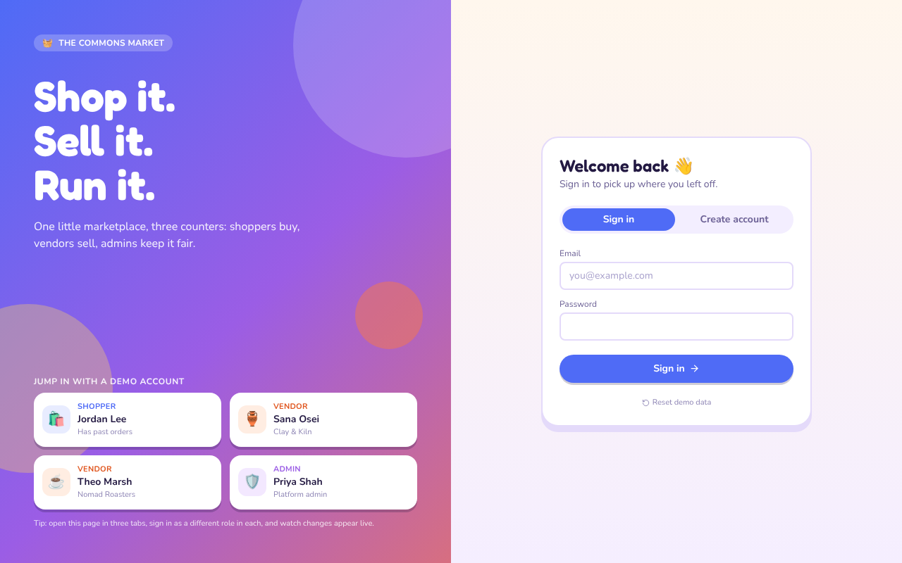
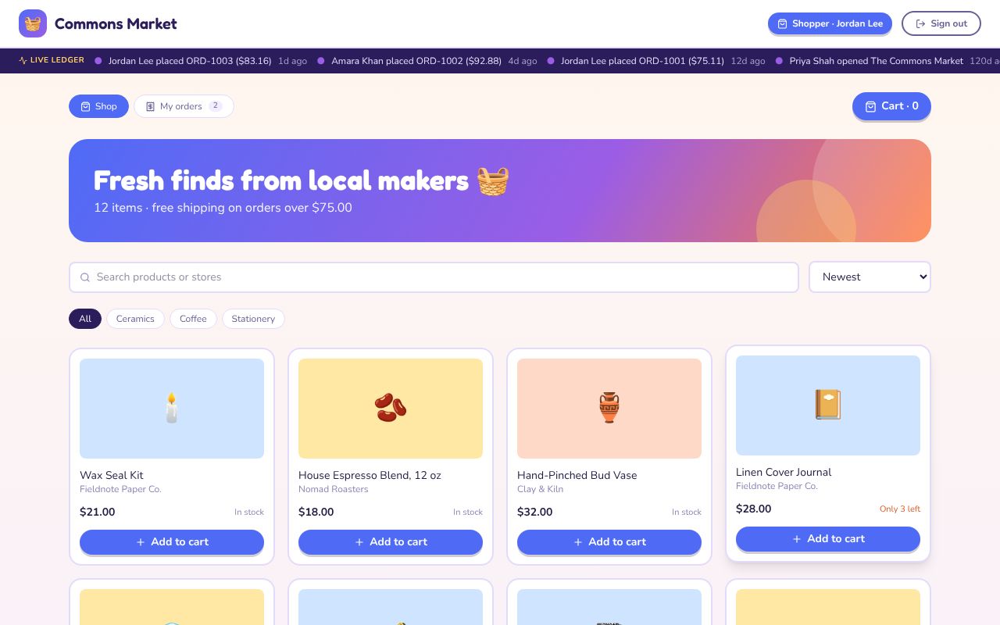
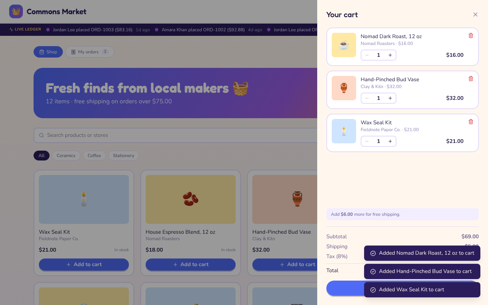
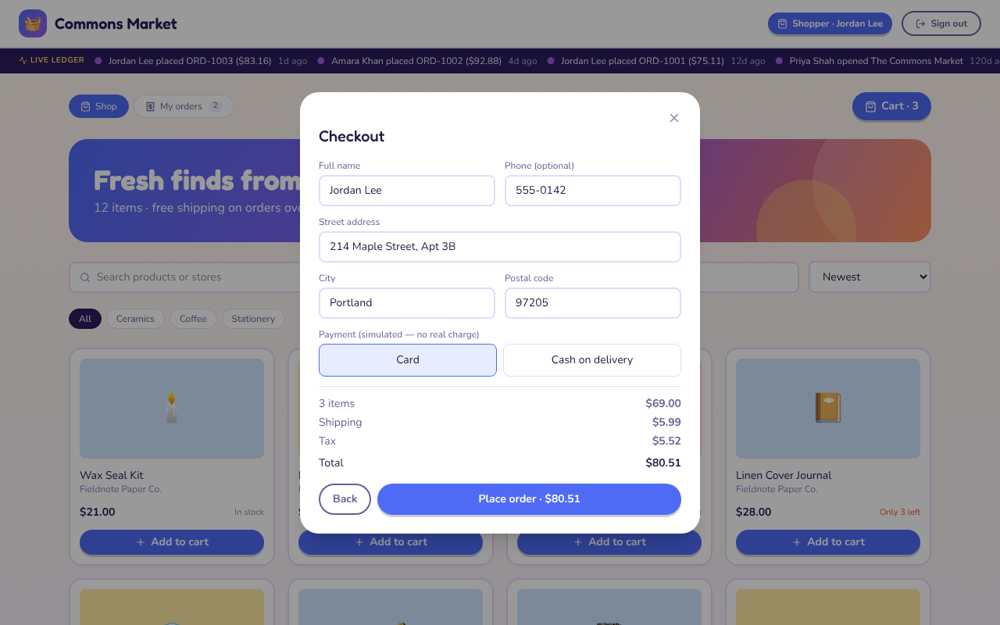
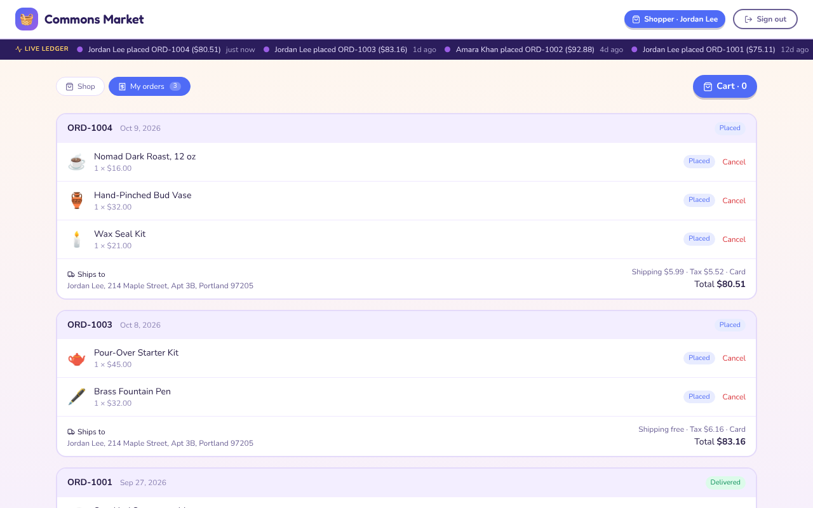
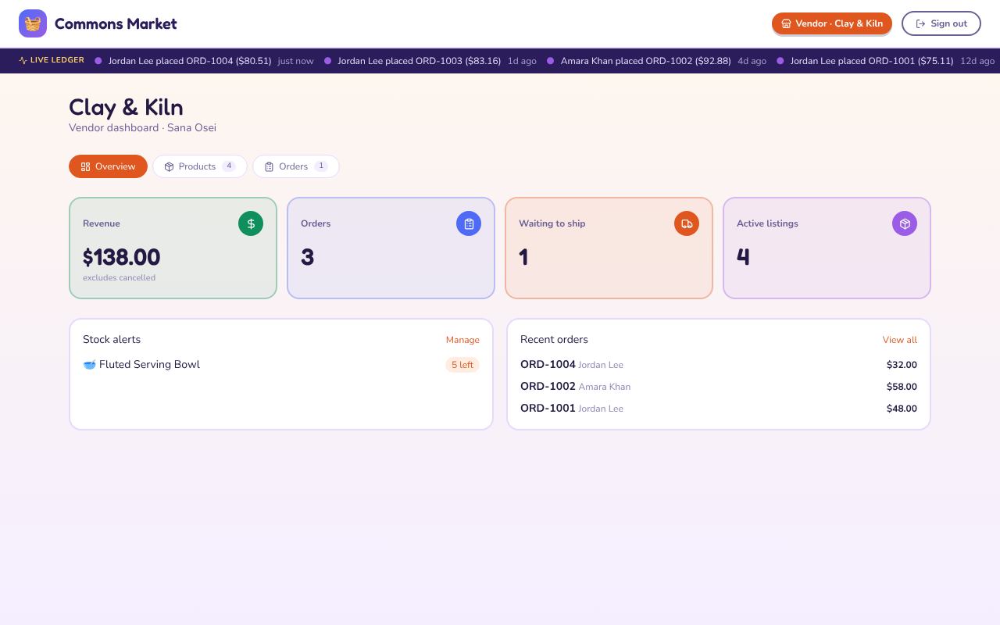
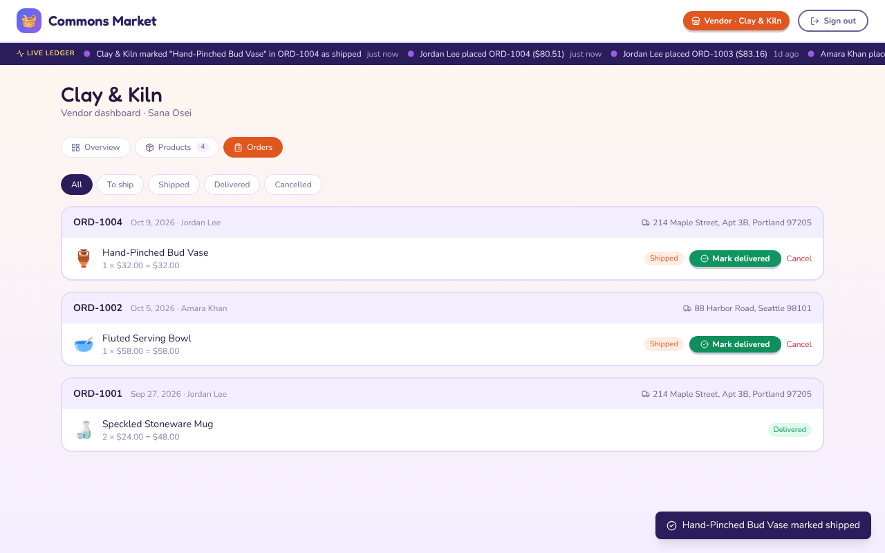
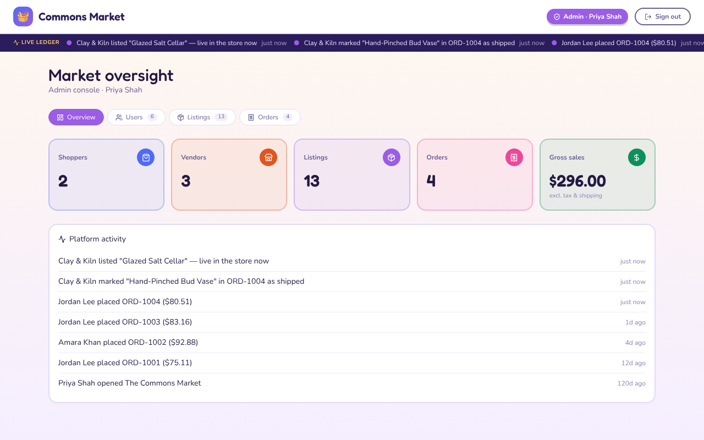
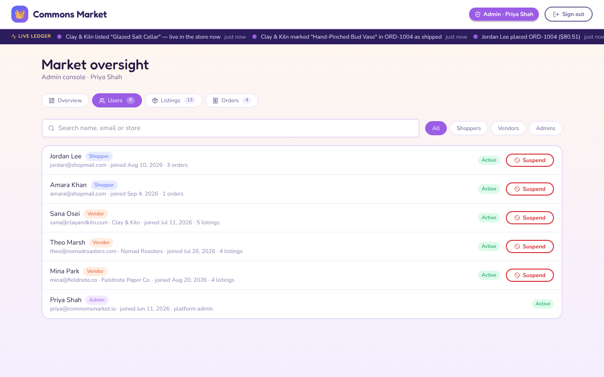
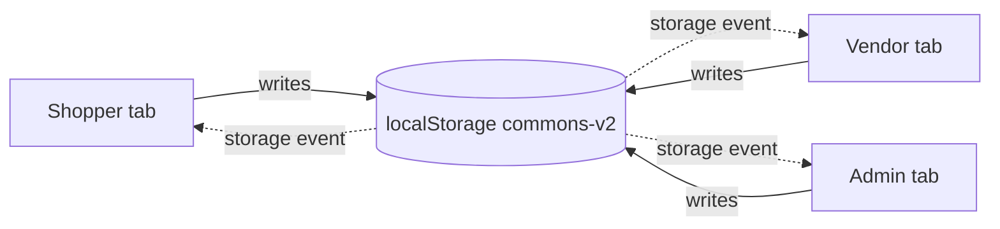

<div align="center">

# 🧺 The Commons Market

### A multi-role marketplace where **shoppers buy**, **vendors sell** and **admins keep it fair**, all on one shared, live data layer.


**[🔗 Live demo](https://REPLACE-WITH-YOUR-VERCEL-LINK.vercel.app)** &nbsp;·&nbsp; **[📸 Screenshots](#-screenshots)** &nbsp;·&nbsp; **[🚀 Run it locally](#-run-it-locally)**

Demo password for every account: **`demo123`**

<br />



</div>

---

## ✨ What is this?

A functional prototype of a three-sided marketplace, built for the brief **"Multi-Role Marketplace Prototype"**: demonstrate a complete role-based flow using local data instead of a production database.

It goes well beyond a click-through mock-up. Passwords are checked, carts respect stock, orders move through a real lifecycle, and an action taken in one role shows up in the others **instantly**. Open it in two or three browser tabs, sign in as a different role in each, and watch them stay in sync.

> **The 60-second story:**
> a **vendor** lists a product → a **shopper** finds it and buys it → the **vendor** marks it shipped → the **shopper's** order updates live → the **admin** sees the sale on the dashboard, suspends the vendor, and every listing they own disappears from the store.

---

## 🎭 Three roles, three experiences

| Capability | 🛍️ Shopper | 🏺 Vendor | 🛡️ Admin |
|---|:---:|:---:|:---:|
| Create an account / sign in | ✅ | ✅ | sign in only |
| Browse, search, filter and sort the store | ✅ | | |
| Product details, cart, checkout | ✅ | | |
| Track and cancel own orders | ✅ | | |
| Add, edit and remove **own** listings | | ✅ | |
| Revenue overview and low-stock alerts | | ✅ | |
| See order lines for **own** items only | | ✅ | |
| Mark items shipped, delivered or cancelled | | ✅ | |
| View **all** users, vendors, listings and orders | | | ✅ |
| Remove **any** vendor's listing | | | ✅ |
| Suspend or reactivate any account | | | ✅ |
| Platform-wide sales stats and activity feed | | | ✅ |

---

## 📸 Screenshots

<table>
  <tr>
    <td width="50%"><b>Shopper · storefront</b><br/>Search, category filters, sorting, stock badges<br/></td>
    <td width="50%"><b>Shopper · cart</b><br/>Live totals, tax and a free-shipping nudge<br/></td>
  </tr>
  <tr>
    <td width="50%"><b>Shopper · checkout</b><br/>Validated address form, saved for next time<br/></td>
    <td width="50%"><b>Shopper · order tracking</b><br/>Per-item status, cancel while still "Placed"<br/></td>
  </tr>
  <tr>
    <td width="50%"><b>Vendor · dashboard</b><br/>Revenue, items to ship, stock alerts<br/></td>
    <td width="50%"><b>Vendor · fulfilment</b><br/>Ship and deliver items, see where they are going<br/></td>
  </tr>
  <tr>
    <td width="50%"><b>Admin · oversight</b><br/>Platform stats and a live activity feed<br/></td>
    <td width="50%"><b>Admin · moderation</b><br/>Search, filter by role, suspend or reactivate<br/></td>
  </tr>
</table>

---

## 🧠 Engineering highlights

**1. One shared data layer, live across roles and tabs.**
All state (`users`, `products`, `orders`, `carts`, `activity`) lives in `localStorage` behind a small `usePersistentState` hook. The hook also listens to the browser's `storage` event, so a write in one tab is adopted by every other open tab, with no polling and no refresh. All business logic sits in one React Context (`useApp`), not scattered across components.



**2. Per-item order lifecycle with a derived order status.**
One order can hold products from several vendors who ship independently, so every line item has its own status (`placed → shipped → delivered`, or `cancelled`). The order-level badge (`Placed`, `In progress`, `Delivered`, `Cancelled`) is **derived** from its items rather than stored, so it can never drift out of sync.

**3. Inventory integrity.**
Cart quantities are capped at available stock. At checkout, stock and vendor status are **re-validated against current data** before an order is written, which protects against another tab buying the last unit. Cancelling an item returns its units to stock.

**4. Suspension that actually cascades.**
Suspending a vendor blocks their login, **signs them out even if they are already logged in on another tab**, hides every one of their listings from the store, and drops their items from shoppers' carts. Reactivating restores all of it.

**5. Per-tab sessions, shared data.**
The signed-in user lives in `sessionStorage` (each tab can be a different role, and a refresh keeps you signed in) while marketplace data is shared in `localStorage`. That split is what makes the three-tab demo possible.

**6. History survives deletion.**
Order items store a snapshot of name, price and vendor, so removing a listing never corrupts past orders.

**7. One pricing function.**
A single `priceOrder()` computes tax and shipping, so the cart, checkout, order history and dashboards always agree to the cent.

**8. Defensive UX.**
Inline form validation, confirmation dialogs for destructive actions, empty states that point to a next step, toast feedback, `Esc` to close dialogs, graceful fallback when `localStorage` is unavailable, and a one-click **Reset demo data**.

### Business rules

| Rule | Behaviour |
|---|---|
| Tax | 8% of the subtotal |
| Shipping | $5.99 flat, **free on orders of $75 or more** (the cart shows how much more you need) |
| Cart quantity | Capped at current stock; sold-out items can't be added |
| Order numbers | Sequential: `ORD-1004`, `ORD-1005`, … |
| Shopper cancellation | Only while an item is still `placed` |
| Vendor cancellation | While an item is `placed` or `shipped` |
| Vendor visibility | Vendors only ever see the order lines that belong to them |
| Shipping address | Saved to the shopper's profile and pre-filled next time |

<details>
<summary><b>More feature detail</b></summary>

<br />

**Authentication**
- Email and password sign-in, or create a **Shopper** or **Vendor** account with validation (email format, password length, unique email, store name for vendors)
- One-click demo accounts for quick evaluation

**Shopper**
- Product detail view with quantity picker and live stock status ("In stock", "Only 3 left", "Sold out")
- Free-shipping progress hint in the cart
- Simulated payment choice: card or cash on delivery

**Vendor**
- Dashboard revenue excludes cancelled items
- Product form with an icon picker, optional image URL (falls back to the icon) and category autocomplete
- Order filters: All, To ship, Shipped, Delivered, Cancelled

**Admin**
- Users tab: search, role filter, per-user listing or order counts
- Listings tab: vendor filter, and a "Hidden · vendor suspended" tag
- Orders tab: expandable rows with items, vendors, status and shipping details

</details>

---

## 🛠️ Tech stack

| Layer | Choice |
|---|---|
| UI | **React** (hooks + Context) |
| Build | **Vite** |
| Styling | **Tailwind CSS v4** plus a few CSS variables |
| Icons | **lucide-react** |
| Data | **`localStorage`** (shared) and **`sessionStorage`** (per-tab login) |
| Type | Fredoka (display) and Nunito (body) via Google Fonts |

No backend, no database and no secrets. It runs entirely in the browser.

---

## 🔑 Demo accounts

Click a card on the login screen, or sign in manually. **The password for every demo account is `demo123`.**

| Role | Name | Email | Notes |
|---|---|---|---|
| 🛍️ Shopper | Jordan Lee | `jordan@shopmail.com` | Has past orders |
| 🛍️ Shopper | Amara Khan | `amara@shopmail.com` | Has past orders |
| 🏺 Vendor | Sana Osei | `sana@clayandkiln.com` | Clay & Kiln · ceramics |
| ☕ Vendor | Theo Marsh | `theo@nomadroasters.com` | Nomad Roasters · coffee |
| 📓 Vendor | Mina Park | `mina@fieldnote.co` | Fieldnote Paper Co. · stationery |
| 🛡️ Admin | Priya Shah | `priya@commonsmarket.io` | Platform admin |

Or use **Create account** to register your own shopper or vendor.

---

## 🚀 Run it locally

**Requirements:** [Node.js](https://nodejs.org) **20.19 or newer** (22.12+ also works).

```bash
# 1. Clone
git clone https://github.com/Saima040/marketplace-prototype.git
cd marketplace-prototype

# 2. Install dependencies
npm install

# 3. Start the dev server
npm run dev
```

Open the URL it prints, usually **http://localhost:5173**.

```bash
npm run build     # production build into /dist
npm run preview   # serve the production build locally
```

### 🗺️ Try the live sync (2 minutes)

1. Open the app in **two or three tabs**.
2. Sign in as **Jordan** in one, **Sana** in another and **Priya** in a third.
3. As Jordan, add items to the cart and check out. The order appears for Sana and Priya without a refresh.
4. As Sana, open **Orders** and click **Mark shipped**, then **Mark delivered**. Jordan's order badge changes.
5. As Priya, review the order, then **suspend a vendor** and watch their products vanish from Jordan's store.

Stuck in a strange state? Click **Reset demo data** at the bottom of the login form.

---

## 🗂️ Data model

```text
users      { id, name, email, password, role: shopper|vendor|admin,
             status: active|suspended, joined, storeName?, address? }

products   { id, vendorId, name, price, stock, category,
             emoji, image?, description, createdAt }

orders     { id, shopperId, shopperName, createdAt, shipTo, payment,
             subtotal, shipping, tax, total,
             items: [ { productId, name, vendorId, qty, price,
                        status: placed|shipped|delivered|cancelled } ] }

carts      { [userId]: [ { productId, qty } ] }

activity   [ { id, ts, text } ]        // powers the "Live ledger" bar
```

Storage keys are prefixed `commons-v2:`, and the logged-in user is kept in `sessionStorage`.

## 📁 Project structure

```text
marketplace-prototype/
├── docs/screenshots/     # README images
├── public/
├── src/
│   ├── App.jsx           # data layer, context + business logic, and the three role views
│   ├── main.jsx
│   └── index.css         # Tailwind import
├── index.html
├── vite.config.js
└── package.json
```

`App.jsx` is organised into sections: persistence hook, helpers and pricing, seed data, app context and business logic, shared UI, then the Auth, Shopper, Vendor and Admin views.

---

## ⚖️ Trade-offs and known limitations

This is a prototype, so some things are deliberately simplified:

- **No real security.** Passwords are stored in plain text in `localStorage`. That is fine for a demo and never acceptable in production. Authorization is enforced in the UI, not on a server.
- **Browser-only data.** Each browser has its own copy, so every visitor to the live demo gets a private marketplace. Cross-tab sync works within one browser.
- **Payments are simulated.** No card details are collected and nothing is charged.
- **Concurrent edits are last-write-wins.** A real backend would need transactions or optimistic concurrency.
- **Single-file app** (~1,800 lines). A larger version would split it into components, hooks and a data module.
- **No automated tests yet.**

## 🛣️ Roadmap

- [ ] Real backend (Node + PostgreSQL, or Supabase) with hashed passwords and JWT sessions
- [ ] Server-side authorization so role rules can't be bypassed from the browser
- [ ] Stripe test-mode payments
- [ ] Image uploads for listings, plus product reviews and ratings
- [ ] Split into components and migrate to TypeScript
- [ ] Vitest unit tests for pricing and order-status logic, and Playwright tests for the three-role flows

---

<div align="center">

Built by [**@Saima040**](https://github.com/Saima040) as *Project 3: Multi-Role Marketplace Prototype*.

If you found this useful or interesting, a ⭐ on the repo is very welcome.

</div>
